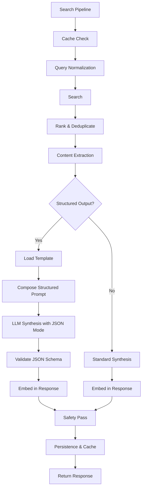
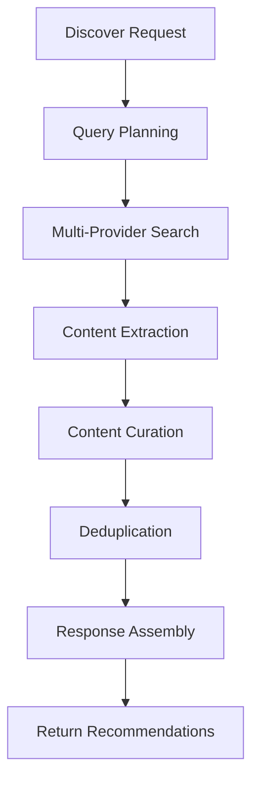

# Local Perplexity Engine - Developer Documentation

## Project Overview

The Local Perplexity Engine is a production-ready implementation of a Perplexity-style search engine with a dual-runner architecture. It provides AI-powered search capabilities with real-time web answers and citations, supporting both a Python-based runner and an n8n workflow-based runner.

### Main Goals

- Provide real-time web answers with citations
- Deliver fast, reliable, deterministic JSON outputs
- Support dual-runner architecture (Python + n8n)
- Enable modular pipeline with replaceable search and scrape backends
- Implement built-in caching, retries, rate-limiting, and deduplication
- Include safety measures and attribution
- **Support structured content generation** (NotebookLM-style Studio Panel)
- **Enable research source discovery** for comprehensive research workflows

### Target Users

- Developers building AI-powered search applications
- Data scientists requiring reliable web research tools
- Organizations needing self-hosted search solutions
- Teams wanting to customize search workflows

## Architecture & Components

The system follows a modular architecture with a clear separation of concerns:

```
[Client/UI/Webhook] → Python Runner or n8n
  ├─ Query Normalizer (LLM optional)
  ├─ Search API (Tavily/Brave/SearchAPI)
  ├─ URL Dedup + Ranking
  ├─ Content Fetch (Firecrawl / Article Extractor)
  ├─ Clean/Chunk/Trim → (optional) Cache/Vectorize
  ├─ Synthesis LLM (Ollama/OpenRouter) → JSON answer + citations
  ├─ Safety pass (LLM or rule set)
  ├─ Persist (DB/Sheet) + Cache
  └─ Respond (JSON)
```

### Core Components

1. **Pipeline Runner** - Orchestrates the complete search process
2. **Search Providers** - Interfaces to various search APIs (Brave, Tavily, SearchAPI)
3. **Content Extractors** - Extract clean content from web pages (Firecrawl, Readability)
4. **Ranking System** - Deduplicates and ranks search results
5. **LLM Providers** - Interfaces to language models (Ollama, OpenRouter)
6. **Caching Layer** - Redis-based caching for performance
7. **Storage Layer** - PostgreSQL for persistent storage
8. **API Layer** - FastAPI-based REST API
9. **CLI Interface** - Command-line interface for direct usage
10. **Web UI** - React-based user interface
11. **Structured Content Generation** - Template-based content synthesis
12. **Discover Sources** - Research planning and source curation

## Folder & File Roles

```
.
├── apps/
│   ├── api/           # FastAPI application
│   │   ├── main.py    # API entry point and routing
│   │   └── routes_discover.py  # Discover sources endpoint
│   └── cli/           # Command-line interface
├── perplexity_core/   # Core pipeline components
│   ├── cache/         # Redis caching
│   ├── search/        # Search providers
│   ├── extract/       # Content extraction
│   ├── rank/          # Ranking and deduplication
│   ├── llm/           # LLM providers
│   ├── synth/         # Synthesis and prompts
│   │   ├── templates/ # Prompt templates
│   │   │   └── structured/  # Structured content templates
│   │   ├── prompts.py # Base prompt definitions
│   │   ├── composer.py # Prompt composition
│   │   ├── repair.py   # JSON repair utilities
│   │   └── structured_prompt.py # Structured content prompt handling
│   ├── safety/        # Safety guard
│   ├── pipeline/      # Main orchestrator
│   │   └── runner.py  # Pipeline implementation
│   ├── store/         # Vector storage interfaces
│   ├── util/          # Utility functions
│   ├── config.py      # Configuration
│   ├── contracts.py   # Data contracts
│   └── hashing.py     # Cache key generation
├── n8n/               # n8n workflow
├── ui/                # Reference UI
│   ├── src/
│   │   ├── components/
│   │   │   ├── studio/   # Structured content components
│   │   │   └── discover/ # Discover sources components
│   │   ├── types/        # TypeScript types
│   │   └── lib/          # API client
│   └── index.html
├── tests/             # Test scripts
│   ├── test_structured_contracts.py  # Structured content validation
│   ├── test_discover_endpoint.py     # Discover endpoint tests
│   └── test_search.py                # Updated search tests
├── docker/            # Docker files
├── .env.example       # Environment example
├── docker-compose.yml # Service orchestration
├── requirements.txt   # Python dependencies
└── pyproject.toml     # Package configuration
```

## Dependencies & Integrations

### Python Dependencies

- **FastAPI** - High performance web framework for APIs
- **Pydantic** - Data validation and settings management
- **HTTPX** - HTTP client for async requests
- **Redis** - Caching layer
- **Typer** - CLI framework
- **BeautifulSoup4** - HTML parsing for content extraction
- **Tenacity** - Retry utilities

### External Services

1. **Search Providers** (Choose one or more):
   - Brave Search API
   - Tavily Search API
   - SearchAPI.io

2. **Content Extraction**:
   - Firecrawl API

3. **Language Models** (Choose one):
   - Ollama (local models)
   - OpenRouter (remote models)

4. **Infrastructure**:
   - Redis (caching)
   - PostgreSQL (persistence)
   - Docker (containerization)

## Data Flow

1. **Input**: User submits a search query via API, CLI, or UI
2. **Cache Check**: System checks Redis for cached results
3. **Query Normalization**: Optional LLM-based query refinement
4. **Search**: Query multiple search providers based on configuration
5. **Ranking**: Deduplicate and rank results based on relevance
6. **Content Extraction**: Extract clean content from top URLs
7. **Synthesis**: Use LLM to synthesize answer with citations
8. **Safety Check**: Apply safety filters to the response
9. **Persistence**: Store results in PostgreSQL
10. **Caching**: Cache results in Redis for future requests
11. **Output**: Return structured JSON response to client

### Structured Content Generation Data Flow

When `output_type` is specified in the search request:
1. **Template Selection**: Load appropriate structured content template
2. **Prompt Composition**: Create system and user prompts with schema
3. **LLM Synthesis**: Generate structured content with JSON schema enforcement
4. **Validation**: Validate generated JSON against schema
5. **Integration**: Embed structured content in response alongside standard fields

### Discover Sources Data Flow

1. **Query Planning**: LLM generates optimized search queries for the topic
2. **Multi-Provider Search**: Execute planned queries across search providers
3. **Content Extraction**: Extract content from discovered URLs
4. **Curation**: Second LLM pass to create annotated recommendations
5. **Deduplication**: Remove duplicate sources
6. **Response**: Return curated recommendations with metadata

## Code Patterns

### Architecture Patterns

1. **Modular Design**: Each component (search, extract, llm) is isolated
2. **Dependency Injection**: Services are injected where needed
3. **Async/Await**: Non-blocking operations for better performance
4. **Configuration-Driven**: Behavior controlled via environment variables
5. **Provider Pattern**: Multiple implementations for search and LLM providers
6. **Template Pattern**: Structured content generation using templates
7. **Pipeline Pattern**: Sequential processing with branching capabilities

### Coding Conventions

1. **Type Hints**: All functions use Python type hints
2. **Pydantic Models**: Data validation using Pydantic
3. **Single Responsibility**: Each module has a clear, single purpose
4. **Error Handling**: Comprehensive exception handling with meaningful messages
5. **Logging**: Structured logging throughout the application
6. **JSON Schema**: Strict schema validation for structured outputs
7. **Markdown Support**: Markdown formatting in structured content fields

## Configuration & Environment

### Environment Variables

The system is configured through environment variables defined in `.env`:

```bash
# Search providers (choose any)
TAVILY_API_KEY=...
BRAVE_API_KEY=...
SEARCHAPI_IO_KEY=...

# Extraction
FIRECRAWL_API_KEY=...

# LLMs
OPENROUTER_API_KEY=...
OPENROUTER_MODEL=x-ai/grok-4-fast:free
OLLAMA_HOST=http://host.docker.internal:11434
OLLAMA_MODEL=qwen3:4b

# Storage/Caching
REDIS_HOST=redis
REDIS_PORT=6379
POSTGRES_HOST=postgres
POSTGRES_DB=perplex
POSTGRES_USER=perplex
POSTGRES_PASSWORD=perplex

# Python runner settings
RUNNER=python  # or n8n
API_HOST=0.0.0.0
API_PORT=8080
LOG_LEVEL=INFO
MAX_CONCURRENCY=6
REQUEST_TIMEOUT_S=20
CACHE_TTL_S=3600

# Structured content generation and discover sources
STRUCTURED_ENABLED=true
DISCOVER_ENABLED=true
STRUCTURED_MAX_TOKENS=2000
DISCOVER_MAX_SOURCES=10
```

### Docker Configuration

Services are orchestrated using Docker Compose with the following containers:
- n8n: Workflow engine
- Redis: Caching layer
- PostgreSQL: Database
- Ollama: Local LLM inference
- API: Python FastAPI server
- Web: React frontend

## Setup & Installation Guide

### Prerequisites

1. Docker and Docker Compose
2. Python 3.11+
3. Node.js 16+ (for UI development)
4. API keys for services you want to use

### Installation Steps

1. **Clone the repository**
   ```bash
   git clone <repository-url>
   cd perplexity-engine
```

### Pipeline Branching for Structured Content

When `output_type` is specified in a search request, the pipeline branches to generate structured content:



### Discover Sources Flow

The discover sources feature follows a specialized pipeline:



## API Endpoints

### Search Endpoint

```
POST /api/search
```

Extended with `output_type` parameter for structured content generation.

### Discover Endpoint

```
POST /api/discover
```

New endpoint for research source discovery and curation.

## Testing

### Unit Tests

- `tests/test_structured_contracts.py` - Validates structured content schemas
- `tests/test_discover_endpoint.py` - Tests discover sources functionality
- `tests/test_search.py` - Extended to cover structured content scenarios

### Integration Tests

- API endpoints tested with curl examples in README
- End-to-end workflows validated through test scripts

## Extensibility

### Adding New Structured Content Types

1. Create new template in `perplexity_core/synth/templates/structured/`
2. Add schema to `perplexity_core/contracts.py`
3. Register template in `perplexity_core/synth/structured_prompt.py`
4. Create frontend renderer in `ui/src/components/studio/`
5. Add type to StudioSwitcher component

### Adding New Search Providers

1. Implement provider in `perplexity_core/search/`
2. Extend base `SearchProvider` class
3. Register in `perplexity_core/pipeline/runner.py`

### Adding New LLM Providers

1. Implement provider in `perplexity_core/llm/`
2. Extend base `LLMProvider` class
3. Register in `perplexity_core/pipeline/runner.py`